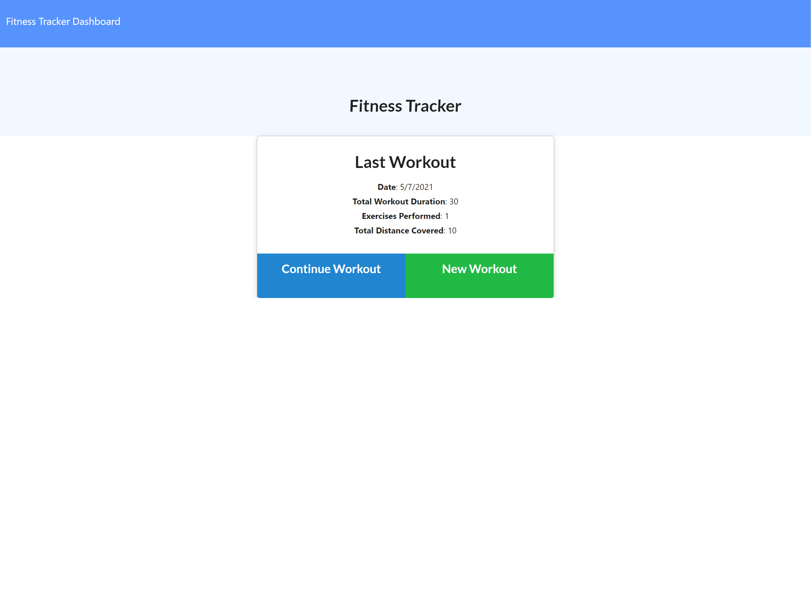

# fitness-tracker

## About

This application allows a user to log and keep track of their cardio and resistance activities during a workout. I wrote the code for the models, routes, and server and the rest of the code was given to me. This application uses MongoDB, Mongoose.js, and Express.js.

## Deployed Site

You can view the deployed site [here](https://peaceful-ravine-37670.herokuapp.com/?id=609585dfb975b8001586992e)

